<div align="center">
  


# AgentKit

**Build AI agents in hours, not weeks.**

A production-ready starter for AI-powered chat applications with web search, authentication, and beautiful UI.

[Live Demo](https://agentkit-demo.vercel.app) · [Quick Start](#quick-start) · [Documentation](#docs)

</div>

---

## Features

<table>
<tr>
<td width="50%">



**AI-Powered Web Search**
Real-time web search with source citations. Toggle on/off instantly.

</td>
<td width="50%">



**Modern Chat Interface**
Streaming responses, file uploads, and tool call visualization.

</td>
</tr>
<tr>
<td width="50%">



**Secure Authentication**
Clerk-powered auth with email/password and OAuth support.

</td>
<td width="50%">



**Developer First**
TypeScript, Prisma, clean architecture, easy to customize.

</td>
</tr>
</table>

## Quick Start

```bash
# Clone
git clone https://github.com/drewsephski/agentkit.git
cd agentkit

# Install
bun install

# Setup env
cp .env.example .env.local
# Add your API keys

# Database
bun prisma migrate dev

# Start
bun dev
```

Open [localhost:3000](http://localhost:3000)

## Stack


## Environment

```env
# Required
NEXT_PUBLIC_CLERK_PUBLISHABLE_KEY=
CLERK_SECRET_KEY=
ANTHROPIC_API_KEY=
DATABASE_URL=

# Optional
NEXT_PUBLIC_APP_URL=http://localhost:3000
```

## Scripts

| Command | Description |
|---------|-------------|
| `bun dev` | Start dev server |
| `bun build` | Production build |
| `bun lint` | Run Biome linter |
| `bun format` | Format code |
| `bun prisma migrate dev` | Run migrations |

## Structure

```
app/           # Next.js App Router
agents/        # AI agent implementations
components/    # React + shadcn/ui
lib/           # Utilities
prisma/        # Database schema
public/        # Assets + videos
```

## License

MIT · Built with ❤️ using [AgentKit](https://github.com/drewsephski/agentkit)
